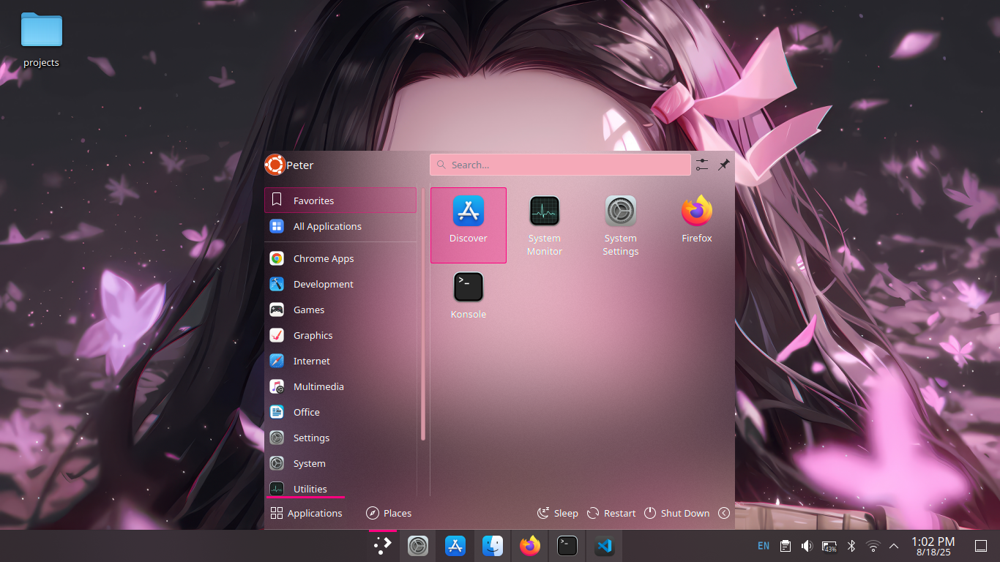

# 🌸 Nezuko Plasma Theme

A custom **KDE Plasma theme** inspired by Nezuko 🌸  
Includes:
- Global theme
- Plasma style
- Cursors
- Icons
- Color scheme

---

## 🖼️ Preview



---

## 📦 Installation

**Before you begin:**  
Make sure you have `inkscape` and `rsvg-convert` installed, as they are required for icon conversion.  
You also need the Qt development packages for building the standalone animated splash:

- `qt5-qmake` – provides `qmake`  
- `qtbase5-dev` – core Qt libraries and headers  
- `qtdeclarative5-dev` – for QML/C++ integration  
- `qml-module-qtquick2` – basic Qt Quick module  
- `qml-module-qtquick-controls2` – Qt Quick Controls 2  
- `qml-module-qtmultimedia` – multimedia support in QML  
- `qtmultimedia5-dev` – C++ multimedia development files  

Install everything on Debian/Ubuntu with:

```bash
sudo apt update
sudo apt install inkscape librsvg2-bin \
qt5-qmake qtbase5-dev qtdeclarative5-dev \
qml-module-qtquick2 qml-module-qtquick-controls2 \
qml-module-qtmultimedia qtmultimedia5-dev build-essential


**Clone this repository:**
```bash
git clone https://github.com/peter-njoro/nezuko-plasma.git
cd nezuko-plasma
```

1. Make the installer script executable:
```bash
chmod +x install.sh
```

2. Run the provided installer script:

```bash
./install.sh
```
## The script will:
- Copy cursors `→ ~/.local/share/icons/Nezuko-Cursors`
- Copy icons `→ ~/.local/share/icons/Nezuko-Icons`
- Copy plasma style `→ ~/.local/share/plasma/desktoptheme/Nezuko`
- Copy global theme `→ ~/.local/share/plasma/look-and-feel/org.kde.nezuko`
- Copy color scheme `→ ~/.local/share/color-schemes/Nezuko.colors`

## ✅ Once installed, apply the theme via:
System Settings → Appearance

- Plasma Style: `Nezuko`

Global Theme: `Nezuko`

Icons: `Nezuko-Icons`

Cursors: `Nezuko-Cursors`

Color Scheme: `Nezuko`

##❌ Uninstallation
Make the unistaller excecutable
```bash
chmod +x uninstall.sh
```
```bash
./uninstall.sh
```
This will delete:
`~/.local/share/icons/Nezuko-Cursors`
`~/.local/share/icons/Nezuko-Icons`
`~/.local/share/plasma/desktoptheme/Nezuko`
`~/.local/share/plasma/look-and-feel/org.kde.nezuko`
`~/.local/share/color-schemes/Nezuko.colors`

## ⚠️ Troubleshooting

- If you see permission denied errors, make sure you cloned/extracted the theme as your user (not root).
Run:
```bash
chown -R $USER:$USER .
```
inside the theme folder before reinstalling.

- If the theme doesn’t show up in System Settings, try logging out/in or restarting Plasma with:
```bash
kquitapp6 plasmashell && kstart6 plasmashell
```
## 🪄 Credits

Made with ❤️ for KDE Plasma fans. Inspired by Nezuko Kamado.